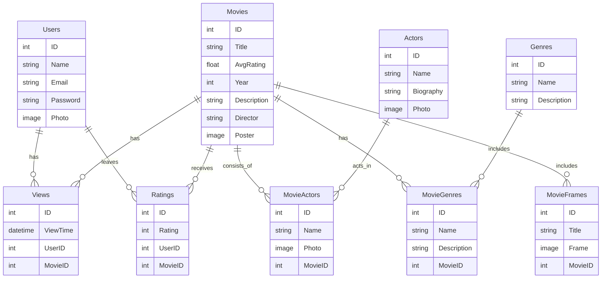

# Filmateka Backend

Бекенд створений для управління даними на сторінці сайту **Filmateka** — онлайн-платформи для перегляду фільмів, де користувачі можуть реєструватися, переглядати та зберігати фільми у власну колекцію.

# Зміст
#### [Учасники команди](#title1)
#### [Переваги](#title2)
#### [Технології](#title3)
#### [Використання](#title4)
#### [Структура](#title5)
#### [Основні Функції](#title6)
#### [Висновок](#title7)

## <a id="title1" style='color: black'>Учасники команди / team members</a>
- Панасенко Діана / Panasenko Diana - Team lead 
>- [Github](https://github.com/PanasenkoDiana "Github")

- Фатуев Михайло / Fatuiev Mykhailo
>- [Github](https://github.com/silopho "Github")

- Зозуля Назар / Nazar Zozulya
>- [Github](https://github.com/Nazar-Zozulya "Github")

- Кошнарьов Данило / Koshnarev Danil
>- [Github](https://github.com/DanilKoshnarev "Github")


## <a id="title2" style='color: black'> Переваги проєкту </a>
1. Масштабованість  
2. Безпека данних
3. Чиста архітектура
4. Надійність 

## <a id="title3" style='color: black'> Технології </a>
- **express**
- **prisma**
- **typescript**
- **SQLite3**
- **Github**
- **JavaScript**


## <a id="title4" style='color: black'> Як запустити проект </a>
#### 1. Встановити додатки  
Node.js використовується у проєкті як середовище виконання JavaScript. Завантажте Node.js за посиланням:  
[https://nodejs.org/en/download](https://nodejs.org/en/download)

Також рекомендовано завантажити редактор коду VSCode:  
[https://code.visualstudio.com/](https://code.visualstudio.com/)

Після встановлення відкрийте консоль у редакторі коду та перевірте встановлення Node.js командою:  
> **```node -v```**  

Для перевірки встановлення менеджера пакетів npm використайте команду:  
> **```npm -v```**

#### 2. Запуск проєкту (локально)  
Клонуємо проєкт з GitHub за допомогою команди:  
> **```git clone https://github.com/PanasenkoDiana/Filmateka.git```**

Переходимо до папки з проєктом:  
> **```cd Filmateka```**

Встановлюємо всі залежності:  
> **```npm i```**

Виконуємо міграції бази даних:  
> **```npm run prisma:migrate```**

Запускаємо сервер локально:  
> **```npm run server```**

#### 3. Запуск проєкту (віддалено)  
Копіюємо посилання на репозиторій з GitHub і в консолі пишемо:  
> **```git clone https://github.com/PanasenkoDiana/Filmateka.git```**

Створюємо віртуальне середовище для Node.js (опціонально, наприклад, за допомогою nvm):  
> **```nvm install 18```**  
> **```nvm use 18```**

Далі переходимо до папки з проєктом:  
> **```cd Filmateka```**

У файлі `.env` вказуємо всі необхідні змінні середовища

На хостингу вказуємо шлях до стартового файлу, наприклад: `server.js`  

Переконуємось, що у розділі налаштувань середовища обрано правильну версію Node.js.

Після цього проєкт буде доступний за віддаленим посиланням, яке надає хостинг-платформа.


## <a id="title5" style='color: black'>Структура проєкту</a>
### Структура бази даних Filmateka


### Файлова структура проєкту

```
Filmаteka/
├── prisma/                      # Налаштування Prisma ORM
│   ├── db/                      # Міграції бази даних
│   └── schema/                  # Схеми даних Prisma
│       ├── genre.prisma         # Схема для жанрів
│       ├── image.prisma         # Схема для зображень
│       ├── movie.prisma         # Схема для фільмів
│       ├── person.prisma        # Схема для персон (актори, режисери тощо)
│       ├── recentlyviewedmovie.prisma # Схема для нещодавно переглянутих фільмів
│       ├── schema.prisma        # Головний файл зі схемами
│       ├── user.prisma          # Схема для користувачів
│       ├── comment.prisma       # Схема для коментарів
│       ├── prismaClient.ts      # Ініціалізація клієнта Prisma
│       └── seed.ts              # Скрипт для наповнення бази даних (seed)
│
├── src/                         # Основний вихідний код застосунку
│   ├── GenresApp/               # Модуль керування жанрами
│   │   ├── genresController.ts  # Контролер для обробки запитів до жанрів
│   │   ├── genresRepository.ts  # Логіка взаємодії з базою даних (жанри)
│   │   ├── genresRouter.ts      # Маршрути (роути) для жанрів
│   │   └── genresService.ts     # Бізнес-логіка для роботи з жанрами
│   │
│   ├── MoviesApp/               # Модуль керування фільмами
│   │   ├── moviesController.ts  # Контролер для обробки запитів до фільмів
│   │   ├── moviesRepository.ts  # Логіка взаємодії з базою даних (фільми)
│   │   ├── moviesRouter.ts      # Маршрути (роути) для фільмів
│   │   └── moviesService.ts     # Бізнес-логіка для роботи з фільмами
│   │
│   ├── PersonsApp/              # Модуль керування персонами (актори, режисери)
│   │   ├── personsController.ts # Контролер для обробки запитів до персон
│   │   ├── personsRepository.ts # Логіка взаємодії з базою даних (персони)
│   │   ├── personsRouter.ts     # Маршрути (роути) для персон
│   │   └── personsService.ts    # Бізнес-логіка для роботи з персонами
│   │
│   ├── UserApp/                 # Модуль керування користувачами
│   │   ├── authMiddleware.ts    # Middleware для автентифікації
│   │   ├── userController.ts    # Контролер для обробки запитів до користувачів
│   │   ├── userRepository.ts    # Логіка взаємодії з базою даних (користувачі)
│   │   ├── userRouter.ts        # Маршрути (роути) для користувачів
│   │   └── userService.ts       # Бізнес-логіка для роботи з користувачами
│   │
│   └── server.ts                # Головний файл запуску сервера (ініціалізація Express)
│
├── types/                       # Типізація (TypeScript)
│   └── express/                 # Кастомні типи для Express
│       ├── index.d.ts           # Декларації типів
│       └── types.ts             # Загальні типи проєкту
│
├── .gitignore                   # Файли та директорії, які ігнорує Git
├── package.json                 # Залежності та скрипти для Node.js
├── README.md                    # Документація проєкту
└── tsconfig.json                # Налаштування TypeScript
```
## <a id="title6" style='color: black'>Основні Функції</a>
#### server.ts  
**Основний серверний файл для запуску додатку**  

```typescript
import express from 'express'

import moviesRouter from "./MoviesApp/moviesRouter"
import genresRouter from "./GenresApp/genresRouter"
import personRouter from "./PersonsApp/personsRouter"
import userRouter from "./UserApp/userRouter"

const cors = require("cors")

const app = express()
const HOST = 'localhost'
const PORT = 8000

// Додаємо підтримку CORS для обробки запитів з інших доменів
app.use(cors())

// Додаємо middleware для обробки JSON-запитів
app.use(express.json())

// Підключаємо маршрути для обробки запитів до різних ресурсів
app.use("/api", moviesRouter)  // Маршрути для фільмів
app.use('/api', genresRouter)  // Маршрути для жанрів
app.use("/api", personRouter)  // Маршрути для персон
app.use("/api", userRouter)    // Маршрути для користувачів

// Запускаємо сервер на вказаному хості та порту
app.listen(PORT, HOST, () => {
    console.log(`Server running at http://${HOST}:${PORT}`);
});
```

##  **Що таке база даних, чому саме SQLite3, яку роль виконує id у таблицях бази даних.** 

**База даних** - це організоване сховище структурованих даних. Це означає, що дані зберігаються в таблицях, які складаються з рядків і стовпців. Кожен рядок представляє окремий запис, а кожен стовпець - певне поле даних.

**ID (ідентифікатор)** - це унікальне поле, яке використовується для однозначної ідентифікації кожного запису в таблиці. Він зазвичай є числом, але також може бути текстовим рядком або комбінацією тексту та чисел.
ID відіграє важливу роль у базах даних, виконуючи такі функції:

- **Первинний ключ:** ID є первинним ключем таблиці, що означає, що він гарантує унікальність кожного запису. Це важливо для запобігання дублюванню даних та забезпечення цілісності бази даних.
- **Зв'язок між таблицями:** ID можна використовувати для зв'язку різних таблиць бази даних. Наприклад, таблиця замовлень може мати поле ID_клієнта, яке посилається на поле ID у таблиці клієнтів. Це дозволяє пов'язувати замовлення з конкретними клієнтами.
- **Індексування: ID** часто використовуються для індексування даних, що робить їх пошук та вибірку швидшими.
- **Фільтрація та сортування:** ID можна використовувати для фільтрації та сортування даних у таблицях.

**Чому саме SQLite3?**  

SQLite3 - це легка, вбудована система керування базами даних, яка не потребує окремого серверного процесу. Вона є чудовим вибором для локальних додатків, тестування та невеликих проєктів.  

Основні переваги SQLite3:  

- **Простота використання:** SQLite3 не потребує налаштування сервера, що робить її ідеальним вибором для невеликих додатків.  
- **Швидкість:** Оскільки база даних зберігається у вигляді одного файлу, операції читання і запису виконуються дуже швидко.  
- **Невеликий розмір:** SQLite3 має компактний розмір і мінімальні вимоги до ресурсів.  
- **Підтримка транзакцій:** Всі операції в SQLite3 є атомарними, що забезпечує цілісність даних.  
- **Кросплатформність:** SQLite3 працює на всіх основних операційних системах без необхідності додаткових налаштувань.  

Таким чином, SQLite3 є оптимальним вибором для проєктів, які не потребують складної інфраструктури баз даних, але при цьому забезпечують швидку та ефективну роботу з даними.  


## **Модель фільму**
**title** – назва фільму.

**rating** – рейтинг (можливо, середній бал від користувачів).

**releaseYear** – рік випуску.

**mainLanguage** – основна мова фільму.

**productionCountry** – країна виробництва.

**ageRating** – віковий рейтинг (наприклад, 12+, 16+).

**runtime** – тривалість у хвилинах.

**poster** – посилання на постер фільму (опціонально).

**shortDescription** – короткий опис фільму (опціонально).

**additionalInfo** – додаткова інформація (опціонально).

**interestingFacts** – цікаві факти про фільм (опціонально).

**comments** – список коментарів (Comment[]).

**movieStills** – кадри з фільму (Image[]).

**persons** – список людей, пов’язаних із фільмом (актори, режисери тощо, Person[]).

**genres** – жанри фільму (Genre[]), зв’язані через відношення MovieGenres.

**recentlyViewedMovie** – список нещодавно переглянутих фільмів (RecentlyViewedMovie[]).

**favorite** – список користувачів (User[]), які додали фільм у вибране.

## Що робить MoviesApp

#### Функції:

- **`getAllMovies`**: Отримує всі фільми з бази даних через `moviesService` і повертає їх у вигляді JSON. Якщо фільми не знайдені, повертається код помилки 404.
  
- **`getMovieById`**: Отримує фільм за конкретним ID, переданим через параметр маршруту. Якщо фільм не знайдений, повертається повідомлення про помилку з кодом 404.
  
- **`getAllRecentlyViewedMovie`**: Отримує всі нещодавно переглянуті фільми та повертає їх у вигляді JSON. Якщо нещодавно переглянуті фільми не знайдені, повертається код помилки 404.

#### Приклад коду для функції `getAllMovies`:

```ts
async function getAllMovies(req: Request, res: Response) {
    try {
        const context = await moviesService.getAllMovies()
        if (context.status === 'error') {
            return res.status(404).json(context)  // Повертаємо 404, якщо фільми не знайдені
        }
        res.json(context)
    } catch (error) {
        res.status(500).json({ status: 'error', message: error.message })  // Повертаємо 500 у разі помилки
    }
}
```


## moviesService.ts
Цей файл містить бізнес-логіку для роботи з даними про фільми. Сервіс викликає репозиторії для отримання даних, обробляє їх і передає контролерам.

Функції:
getAllMovies: Отримує всі фільми через moviesRepository. Якщо фільми знайдені, повертає їх у форматі JSON. Якщо фільми не знайдені, повертається помилка.

getMovieById: Отримує фільм за ID. Якщо фільм знайдений, повертає його в форматі JSON. Якщо фільм не знайдений, повертається помилка.

getAllRecentlyViewedMovie: Отримує список нещодавно переглянутих фільмів та повертає його у форматі JSON.

Приклад коду для функції getAllMovies:
```ts

async function getAllMovies(): Promise<IError | ISuccess<Movie[]>> {
    const movies = await moviesRepository.getAllMovies()
    if (!movies) {
        return { status: 'error', message: 'Фільми не знайдені' }
    }
    return { status: 'success', data: movies }
}
```

## moviesController.ts
Цей файл містить функції, які обробляють HTTP запити для API. Він викликає відповідні сервіси для взаємодії з даними та передає результат назад клієнту у форматі JSON. Контролери зазвичай відповідають за маршрутизацію та взаємодію з бізнес-логікою (сервісами).

Функції:
getAllMovies: Обробляє запит для отримання всіх фільмів через moviesService. Повертає список фільмів у форматі JSON або помилку, якщо фільми не знайдені.

getMovieById: Обробляє запит для отримання конкретного фільму за ID. Якщо фільм знайдений, повертає його у форматі JSON. Якщо фільм не знайдений, повертається повідомлення про помилку.

getAllRecentlyViewedMovie: Обробляє запит для отримання списку нещодавно переглянутих фільмів через moviesService.

Приклад коду для функції getAllMovies:
```ts
Копіювати
Редагувати
async function getAllMovies(req: Request, res: Response) {
    try {
        const context = await moviesService.getAllMovies()
        if (context.status === 'error') {
            return res.status(404).json(context)  // Повертаємо 404, якщо фільми не знайдені
        }
        res.json(context)
    } catch (error) {
        res.status(500).json({ status: 'error', message: error.message })  // Повертаємо 500 у разі помилки
    }
}
```


## moviesRepository.ts
Цей файл містить логіку для роботи з базою даних або іншими джерелами даних. Репозиторій відповідає за доступ до даних та їх збереження. Зазвичай репозиторії використовуються для абстракції взаємодії з базою даних чи іншими сховищами даних.

Функції:
getAllMovies: Отримує список всіх фільмів з бази даних або іншого джерела даних. Якщо фільми не знайдені, повертає null.

getMovieById: Отримує фільм за конкретним ID з бази даних. Якщо фільм не знайдений, повертає null.

getAllRecentlyViewedMovie: Отримує список нещодавно переглянутих фільмів із бази даних.

Приклад коду для функції getAllMovies:
```ts
async function getAllMovies(): Promise<Movie[] | null> {
    // Приклад запиту до бази даних
    const result = await db.query('SELECT * FROM movies')
    if (result.rows.length === 0) {
        return null  // Якщо фільми не знайдені, повертаємо null
    }
    return result.rows
}
```

### movieRouter.ts
Цей файл описує маршрути для API, які обробляються контролерами. Маршрути визначають, які запити обробляти і якими функціями з контролера.

Опис маршрутів:
GET /movies: Викликає getAllMovies з moviesController для отримання всіх фільмів.

GET /movie/:id: Викликає getMovieById з moviesController для отримання конкретного фільму за ID.

GET /resent-viewed-movies: Викликає getAllRecentlyViewedMovie з moviesController для отримання списку нещодавно переглянутих фільмів.

Приклад коду для маршруту:
```ts

import { Router } from 'express'
import moviesController from './moviesController'

const router = Router()

// Маршрут для отримання всіх фільмів
router.get('/movies', moviesController.getAllMovies)
// Маршрут для отримання фільму за ID
router.get('/movie/:id', moviesController.getMovieById)
// Маршрут для отримання нещодавно переглянутих фільмів
router.get('/resent-viewed-movies', moviesController.getAllRecentlyViewedMovie)

export default router

```


## <a id="title7" style='color: black'>Висновок</a>  
Бекенд для проєкту Filmateka був створений для ефективного управління даними на онлайн-платформі для перегляду фільмів. Ця система дозволяє користувачам реєструватися, переглядати інформацію про фільми та додавати їх у власну колекцію. Використання сучасних технологій, таких як **Node.js, Express, TypeScript** та **REST API**, забезпечує швидку та безпечну взаємодію з базою даних.  

Розробка проєкту допомогла нам вдосконалити навички роботи з серверною частиною веб-додатків, оптимізувати процеси взаємодії клієнта та сервера, а також застосувати принципи безпечної авторизації користувачів. Робота над Filmateka стала цінним досвідом у нашій кар'єрі, дозволивши нам краще зрозуміти архітектуру бекенду та розширити знання у сфері веб-розробки.
